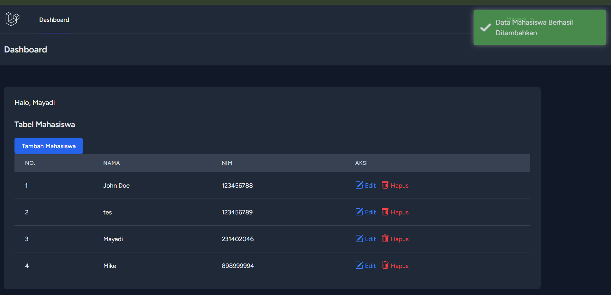

## Pertemuan P-IMK 5 (Meningkatkan Pengalaman Pengguna Dalam Operasi CRUD Dengan Dialog Interaktif)

### Tugas

- Membuat modal tambahan untuk edit
- Membuat notification untuk operasi lainnya

## Demo

### - Register Berhasil

### - Modal Edit

### - Edit Berhasil

### - Modal Delete Confirmation

### - Delete Berhasil

### - Add Data Berhasil

